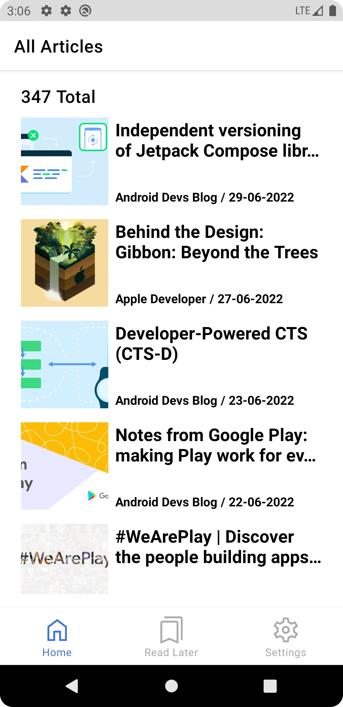
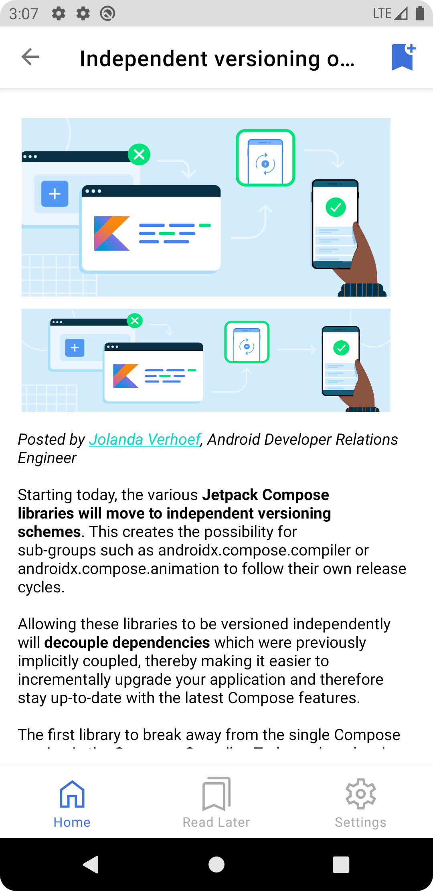
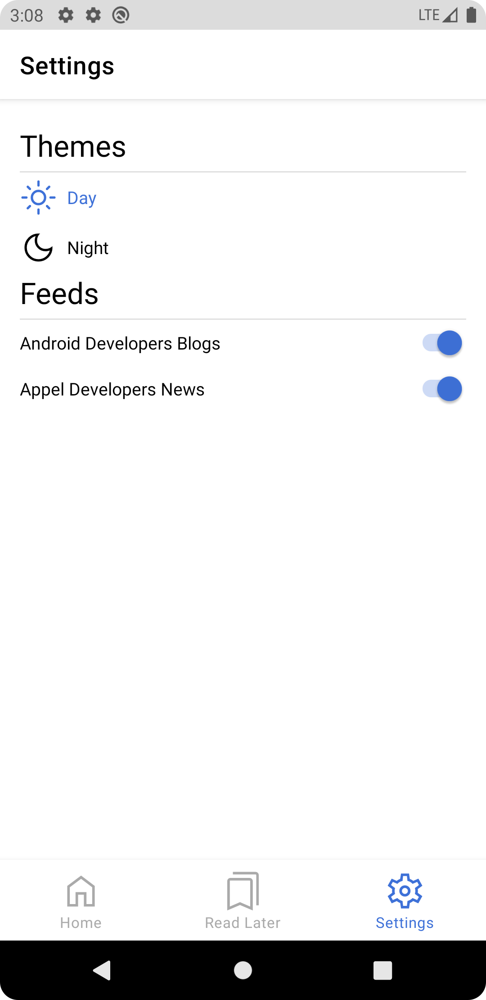
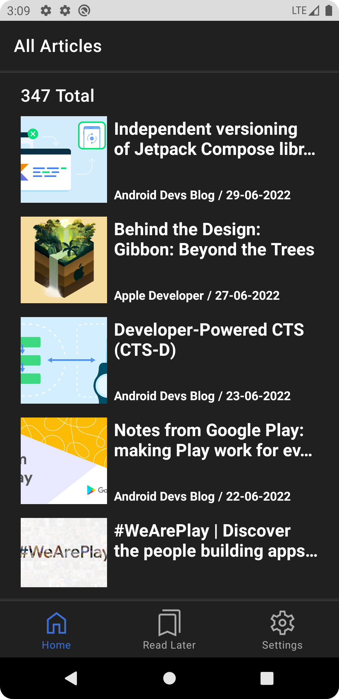
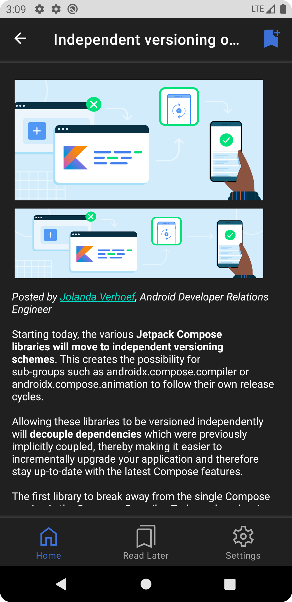
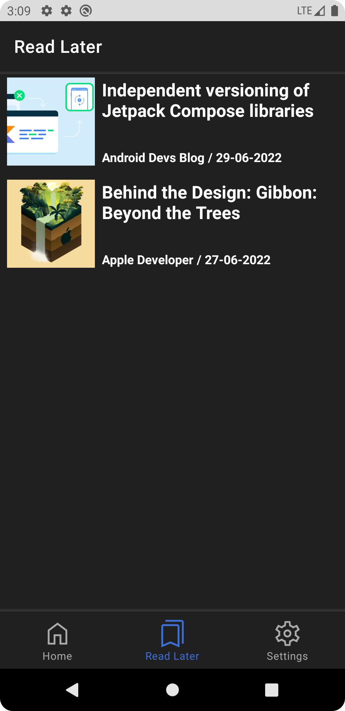
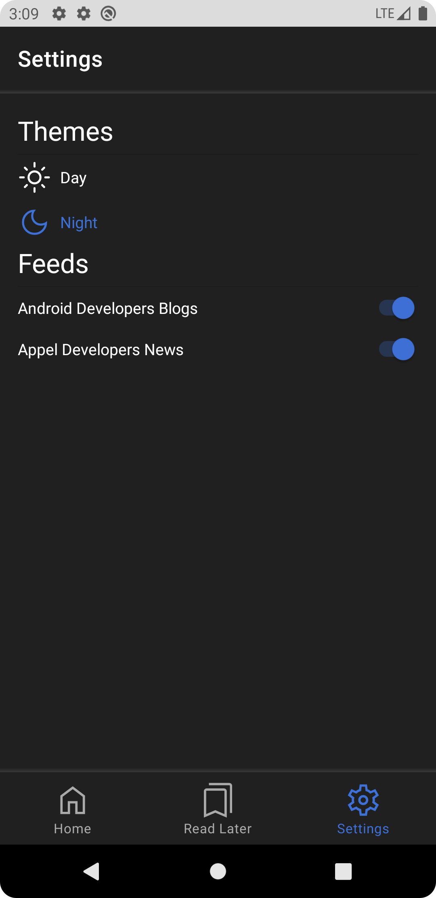

# Rss Reader
App made for the monthly challenge of [Mouredev](https://kotlinlang.org/)
[Android Dev Blog](https://android-developers.googleblog.com)

[Apple News](https://developer.apple.com/news/)

In this project I developed a Android App with:
- MVVM architecture
- Kotlin Coroutines
- Fragments
- Flow
- Jetpack (View Model, Room)
- Retrofit & converterXml
- Glide
- Hilt
- Material Design

## Download The App
Download the app [Here](https://github.com/DanielMM161/RssReader/raw/master/app/release/rssreader_dmm.apk)

## 📷 Previews

 
 
 
 

## 📷 Previews Dark Mode

 
 
 
 

## 🏛️ Architecture
Rss Reader is based on the MVVM architecture and the Repository pattern.

## 🛠 Tech stack & Open-source libraries
- Minimum SDK level 21
- [Kotlin](https://kotlinlang.org/), [Coroutines](https://github.com/Kotlin/kotlinx.coroutines) + [Flow](https://kotlin.github.io/kotlinx.coroutines/kotlinx-coroutines-core/kotlinx.coroutines.flow/) for asynchronous.
- Jetpack
  - Lifecycle - Observe Android lifecycles and handle UI states upon the lifecycle changes.
  - ViewModel -  Designed to store and manage UI-related data in a lifecycle conscious way. Allows data to survive configuration changes such as screen rotations.
  - DataBinding - Data Binding Library is a support library that allows you to bind UI components in your layouts to data sources in your app using a declarative format rather than programmatically.
  - Room Persistence - Constructs Database by providing an abstraction layer over SQLite to allow fluent database access.
- Architecture
  - MVVM Architecture (View - DataBinding - ViewModel - Model)
  - Repository Pattern
- [Retrofit2 & OkHttp3](https://github.com/square/retrofit) - Construct the REST APIs.
- [Glide](https://github.com/bumptech/glide) - Loading images from network
- [Hilt](https://github.com/googlecodelabs/android-hilt) - Dependency Injection
